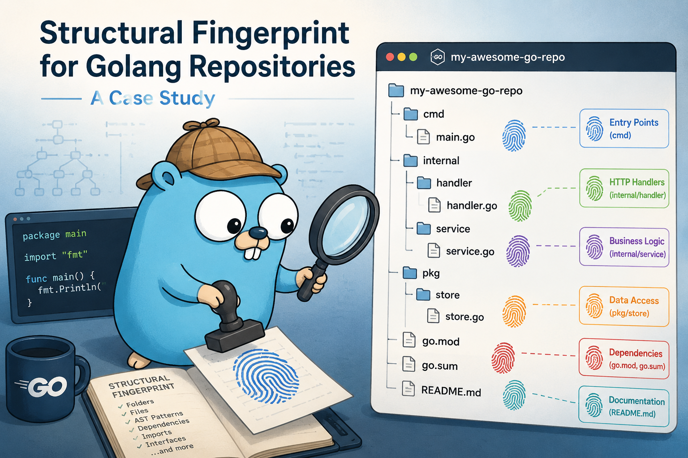

[](https://github.com/somak2kai/beats/actions/workflows/ci.yml)
[](https://goreportcard.com/report/github.com/somak2kai/beats)
[](https://github.com/somak2kai/beats/releases/latest)
[](LICENSE)
[](https://somak2kai.github.io/beats/)

---

<p align="center">
  
</p>

# beats

> Measure the structural fingerprint of a Go codebase.

beats clusters Go functions by the **skeleton of how they are written** — independent of names, comments, domain vocabulary or semantic meaning. The goal is to find meaningful patterns in code by looking at what it does structurally, not what it means semantically.
<br>

> Why beats

Well the original idea was to evaluate congnitive load of a piece of code. I generally believe, cognitive load in a codebase isn't caused by complexity alone, it's caused by unexplained structural variance. When every function that does X looks different, your brain can't build a model. Beats finds where the variance is and where it isn't.

### Reports from sample OSS repositories

| Project | Repository | Report |
|---|---|---|
| Argo CD | [argoproj/argo-cd](https://github.com/argoproj/argo-cd) | [View →](https://somak2kai.github.io/beats/report-argocd.html) |
| cAdvisor | [google/cadvisor](https://github.com/google/cadvisor) | [View →](https://somak2kai.github.io/beats/report-cadvisor.html) |
| CockroachDB | [cockroachdb/cockroach](https://github.com/cockroachdb/cockroach) | [View →](https://somak2kai.github.io/beats/report-cockroachdb.html) |
| Gitea | [go-gitea/gitea](https://github.com/go-gitea/gitea) | [View →](https://somak2kai.github.io/beats/report-gitea.html) |
| Mattermost | [mattermost/mattermost-server](https://github.com/mattermost/mattermost-server) | [View →](https://somak2kai.github.io/beats/report-mattermost.html) |

---

## What is beats?

beats identifies recurring structural patterns across an entire Go codebase to answer one question: *does the golang code across the repository coalesce to form a structural pattern and if so, how can we identify and evaluate the same?*

Beats define **Structural fingerprint** as follows.

For each function, beats computes three features:

1. **Token sequence** — an ordered list of AST mnemonics representing the structural skeleton of the function body. Each token is a normalised AST node, for example : `CALL` for a function call, `ASSIGN` for a variable assignment, `RETURN` for a return statement (with arity), `IF`, `FOR`, `RANGE`, and so on. No names, no literals — only structure.

2. **Direct imports** — the set of packages actually used within the function (not just imported by the file). This captures the dependency shape at the function level, not the file level.

3. **Call targets (fan-out)** — the set of external functions invoked within the function body.

No attempt is made to understand *what* a call target does or *what* an import statement provides. That would reintroduce vocabulary dependence and defeat the purpose.

These three features — along with some additional metadata — form a **FunctionMetadata** record. Beats collects FunctionMetadata across the entire codebase and clusters them using a weighted similarity function:

| Feature | Weight |
|---|---|
| Token sequence similarity | 50% |
| Jaccard similarity of import sets | 30% |
| Jaccard similarity of call target sets | 20% |

The output is *N* clusters, each with a **coherence value** — a measure of how tightly packed the function metadata within it are. Coherence is broken into two axes:

| | **High Call Cohesion** | **Low Call Cohesion** |
|---|---|---|
| **High Import Cohesion** | Tight domain-local pattern — shares both package context and call vocabulary. Most actionable. | Domain-cohesive, structurally diverse — shared package domain, divergent calls. May benefit from splitting. |
| **Low Import Cohesion** | Cross-cutting structural pattern — different domains, same structural role (e.g. cron registration, adapters). | Likely noise — coincidental structural similarity rather than convention. Treat with scepticism. |


---

<details>
<summary><strong>📦 Installation</strong></summary>
<br>

### Prerequisites

- Go 1.21 or later
- Git

### Install via Homebrew (macOS / Linux)

```bash
brew tap somak2kai/tap
brew install beats
```

Upgrade to the latest release at any time:

```bash
brew upgrade beats
```

### Install from source

Clone the repository and build the CLI:

```bash
git clone https://github.com/somak2kai/beats.git
cd beats
go build -o beats ./cmd/
```

Move the binary somewhere on your `$PATH`:

```bash
mv beats /usr/local/bin/
```

Or run directly without installing:

```bash
go run ./cmd/ <command> [flags]
```

### Verify

```bash
beats --version
```

</details>

---

<details>
<summary><strong>🚀 Usage</strong></summary>
<br>

beats has one main commands: `init` to index a repository , to create clusters and report on it.

---

### `beats init` — index a repository

Walks a Go codebase and writes FunctionMetadata records into a local Badger store.

```bash
beats init --repo=<path-to-go-repository>
```

**Example:**

```bash
beats init --repo=/home/user/projects/myservice
```

**What gets indexed:**
- All Go source files under the repository root (excluding `vendor/` and test files by default, auto generated files such as pb.go)
- For each exported and unexported function: token sequence, call targets, direct imports, file path, line number, package name
- runs the clustering algorithm, and produces an HTML report at `<repo>/.beats/report.html`.

---

Open the report:

```bash
open /home/user/projects/myservice/.beats/report.html
```

The report shows all clusters sorted by combined coherence, with per-cluster member lists, top imports, Cyclo P95, package distribution, and a coherence quadrant breakdown.

---

</details>

---

<details>
<summary><strong>📊 Report Analyser</strong></summary>
<br>

The `analyzer/` package contains a Python script for parsing and summarising beats HTML reports in the terminal.

→ **[analyzer/README.md](analyzer/README.md)**

What it covers:
- How to run `analyze_report.py` against any beats report
- Coherence quadrant reference table
- Sample output from a real analysis run (Gitea, ~500 clusters)

</details>

---

<details>
<summary><strong>🔬 SCIP Validation Tool</strong></summary>
<br>

The `x/tools/cmp/` package contains a comparison tool that validates beats clusters against [SCIP](https://github.com/sourcegraph/scip) (Sourcegraph Code Intelligence Protocol) reference data. It computes precision, recall, and F1 per cluster to measure how well the structural fingerprint aligns with semantic reference graphs.

→ **[x/tools/cmp/README.md](x/tools/cmp/README.md)**

What it covers:
- Installing and running `scip-go` on a repository
- Running the beats vs SCIP comparison
- How to interpret recall, precision, and F1 in the beats context
- Why low precision is expected (and desirable) behaviour

</details>

---
