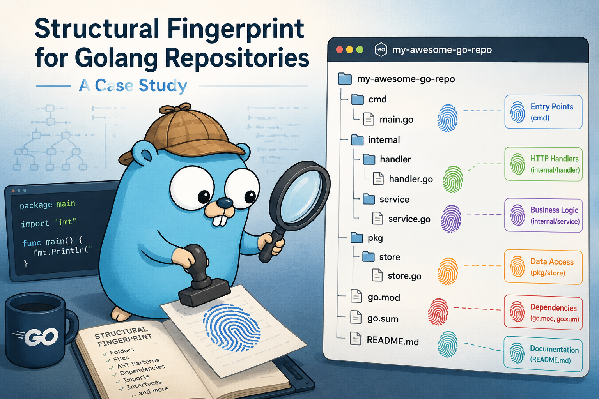

[](https://github.com/somak2kai/beats/actions/workflows/ci.yml)
[](https://goreportcard.com/report/github.com/somak2kai/beats)
[](https://github.com/somak2kai/beats/releases/latest)
[](LICENSE)
[](https://somak2kai.github.io/beats/)

---

<p align="center">
  
</p>

# beats

> Measure the structural fingerprint of a Go codebase.

beats clusters Go functions by the **skeleton of how they are written** — independent of names, comments, domain vocabulary or semantic meaning. The goal is to find meaningful patterns in code by looking at what it does structurally, not what it means semantically.

📖 [Read the full story on Medium →](https://medium.com/@somaktukai/structural-fingerprint-for-golang-repositories-a-case-study-ae560bafec84)
<br>

> Why beats

Every codebase has a rhythm — recurring structural patterns that developers fall into without naming them. Beats finds that pulse. When the rhythm is steady, you have convention. When it's irregular, you have cognitive load.

Well the original idea was to evaluate congnitive load of a piece of code. I generally believe, cognitive load in a codebase isn't caused by complexity alone, it's caused by unexplained structural variance. When every function that does X looks different, your brain can't build a model. Beats finds where the variance is and where it isn't.

### Reports from sample OSS repositories

| Project | Repository | Report |
|---|---|---|
| Argo CD | [argoproj/argo-cd](https://github.com/argoproj/argo-cd) | [View →](https://somak2kai.github.io/beats/report-argocd.html) |
| cAdvisor | [google/cadvisor](https://github.com/google/cadvisor) | [View →](https://somak2kai.github.io/beats/report-cadvisor.html) |
| CockroachDB | [cockroachdb/cockroach](https://github.com/cockroachdb/cockroach) | [View →](https://somak2kai.github.io/beats/report-cockroachdb.html) |
| Gitea | [go-gitea/gitea](https://github.com/go-gitea/gitea) | [View →](https://somak2kai.github.io/beats/report-gitea.html) |
| Mattermost | [mattermost/mattermost-server](https://github.com/mattermost/mattermost-server) | [View →](https://somak2kai.github.io/beats/report-mattermost.html) |

---

## What is beats?

beats identifies recurring structural patterns across an entire Go codebase to answer one question: *does the golang code across the repository coalesce to form a structural pattern and if so, how can we identify and evaluate the same?*

Beats define **Structural fingerprint** as follows.

For each function, beats computes three features:

1. **Token sequence** — an ordered list of AST mnemonics representing the structural skeleton of the function body. Each token is a normalised AST node, for example : `CALL` for a function call, `ASSIGN` for a variable assignment, `RETURN` for a return statement (with arity), `IF`, `FOR`, `RANGE`, and so on. No names, no literals — only structure.

2. **Direct imports** — the set of packages actually used within the function (not just imported by the file). This captures the dependency shape at the function level, not the file level.

3. **Call targets (fan-out)** — the set of external functions invoked within the function body.

No attempt is made to understand *what* a call target does or *what* an import statement provides. That would reintroduce vocabulary dependence and defeat the purpose.

These three features — along with some additional metadata — form a **FunctionMetadata** record. <br>
Beats collects FunctionMetadata across the entire codebase and clusters structurally similar functions. Similarity between two functions is computed as the geometric mean of three signals, each normalized to [0, 1]: token-sequence similarity (1 − normalized Levenshtein distance), Jaccard overlap of imports, and Jaccard overlap of called functions. Using the geometric mean (∛(A·B·C)) rather than a weighted sum means a pair must score well across all three dimensions to be considered similar — a function with high token overlap but no shared imports or calls won't be treated as a match

The output is *N* clusters, each with a **coherence value** — a measure of how tightly packed the function metadata within it are. Coherence is broken into two axes:

| | **High Call Cohesion** | **Low Call Cohesion** |
|---|---|---|
| **High Import Cohesion** | Tight domain-local pattern — shares both package context and call vocabulary. Most actionable. | Domain-cohesive, structurally diverse — shared package domain, divergent calls. May benefit from splitting. |
| **Low Import Cohesion** | Cross-cutting structural pattern — different domains, same structural role (e.g. cron registration, adapters). | Likely noise — coincidental structural similarity rather than convention. Treat with scepticism. |

### Potential outliers

Functions that came structurally close to a cluster — but didn't meet the similarity threshold to join — are **potential outliers**. They look like they should follow a convention but deviate in a specific, measurable way.

For each outlier, beats surfaces the exact gap between the function and its closest cluster:

- **Token delta** — token types present in the outlier but absent from the cluster's common subsequence, or vice versa. A `+IF` means the outlier has an extra branch peers don't; a `−DEFER` means it's missing a cleanup step they all share.
- **Import delta** — packages the outlier uses that peers don't, or packages peers consistently use that this function omits.
- **Call delta** — specific call targets (e.g. `errors.Is`, `sync.Mutex.Lock`) that peers share but the outlier skips, or that the outlier adds beyond the cluster norm.
- **Cyclomatic delta** — how much more or less complex the outlier is relative to the cluster mean.

The HTML report groups outliers by their closest cluster and visualises the signal across three charts:

- **Package coverage** — the top 20 packages by function count, split into clustered (settled convention) vs outliers (structural ad-hoc). Surfaces which areas of the codebase have converged on patterns and which haven't.
- **Delta direction** — breaks all outliers into three buckets: missing something peers have (strongest signal), extending beyond peers, or both. A repo dominated by the "missing" bucket has more structural drift worth reviewing.
- **Token frequency** — the top 10 token types most commonly absent from outliers compared to their peer clusters. A dominant type appearing across many outliers (e.g. `DEFER`, `IF`) signals a systemic gap rather than a one-off.

beats also writes `<repo>/.beats/outlier.md` after indexing — a pre-computed document with every outlier, its deltas, and the full bodies of its closest cluster's peer functions. This is what the Claude skill reads to triage outliers without issuing any further queries.

Remember, beats is a lens - not a prescription.

---

<details>
<summary><strong>🤖 Analyse with Claude</strong></summary>
<br>

beats ships a Claude plugin that wires the outlier triage into a conversational skill.

### Install the plugin

Inside Claude Code or Cowork, add the marketplace and install:

```
/plugin marketplace add somak2kai/beats
/plugin install beats@beats
```


### Recommended workflow — index outside Claude, analyse inside

> **Index in your terminal, triage in Claude.** This is the lowest-cost way to run beats.

`beats init` does pure computation — parsing, clustering, writing the database. It produces no output that needs LLM reasoning. Running it inside Claude wastes tokens on a step that doesn't benefit from them.

**Step 1 — index in your terminal:**

```bash
beats init --repo /path/to/your/go/repo
```

This writes `<repo>/.beats/outlier.md` and `<repo>/.beats/report.html`. No Claude involved.

**Step 2 — triage in Claude:**

> `mini fingerprint`

Tell Claude the repo path when prompted. Claude reads `outlier.md` directly and outputs the full triage — no indexing, no repeated database queries, just analysis.

This keeps Claude's token budget focused entirely on the one step that actually needs it.

### Full mode (all-in-one)

If you prefer to run everything through Claude in one command:

> `run beats on /path/to/your/go/repo`

Claude will handle install verification, `beats init`, triage, and the HTML report. Convenient, but costs more tokens since indexing runs inside the Claude session.

### What the LLM analysis does

For each outlier, Claude matches its `closest cluster` hash to the peer cluster in `outlier.md` and reads the actual function bodies of every cluster member. It then asks one question per structural signal:

> *Does the function body explain this deviation from its peers?*

If yes → Expected Variation. If no → Needs Attention. The verdict is always tied to a specific delta — a token type, import, call target, or cyclo difference — not a general code quality opinion.

</details>

---

<details>
<summary><strong>📦 Installation</strong></summary>
<br>

### Prerequisites

- Go 1.21 or later
- Git

### Install via Homebrew (macOS / Linux)

```bash
brew tap somak2kai/tap
brew install beats
```

Upgrade to the latest release at any time:

```bash
brew upgrade beats
```

### Install from source

Clone the repository and build the CLI:

```bash
git clone https://github.com/somak2kai/beats.git
cd beats
go build -o beats ./cmd/
```

Move the binary somewhere on your `$PATH`:

```bash
mv beats /usr/local/bin/
```

Or run directly without installing:

```bash
go run ./cmd/ <command> [flags]
```

### Verify

```bash
beats --version
```

</details>

---

<details>
<summary><strong>🚀 Usage</strong></summary>
<br>

beats has one main commands: `init` to index a repository , to create clusters and report on it.

---

### `beats init` — index a repository

Walks a Go codebase and writes FunctionMetadata records into a local Badger store.

```bash
beats init --repo=<path-to-go-repository>
```

**Example:**

```bash
beats init --repo=/home/user/projects/myservice
```

**What gets indexed:**
- All Go source files under the repository root (excluding `vendor/` and test files by default, auto generated files such as pb.go)
- For each exported and unexported function: token sequence, call targets, direct imports, file path, line number, package name
- runs the clustering algorithm, and produces an HTML report at `<repo>/.beats/report.html`.

---

Open the report:

```bash
open /home/user/projects/myservice/.beats/report.html
```

The report shows all clusters sorted by combined coherence, with per-cluster member lists, top imports, Cyclo P95, package distribution, and a coherence quadrant breakdown.

---

</details>

---

<details>
<summary><strong>📊 Report Analyser</strong></summary>
<br>

The `analyzer/` package contains a Python script for parsing and summarising beats HTML reports in the terminal.

→ **[analyzer/README.md](analyzer/README.md)**

What it covers:
- How to run `analyze_report.py` against any beats report
- Coherence quadrant reference table
- Sample output from a real analysis run (Gitea, ~500 clusters)

</details>

---

<details>
<summary><strong>🔬 SCIP Validation Tool</strong></summary>
<br>

The `x/tools/cmp/` package contains a comparison tool that validates beats clusters against [SCIP](https://github.com/sourcegraph/scip) (Sourcegraph Code Intelligence Protocol) reference data. It computes precision, recall, and F1 per cluster to measure how well the structural fingerprint aligns with semantic reference graphs.

→ **[x/tools/cmp/README.md](x/tools/cmp/README.md)**

What it covers:
- Installing and running `scip-go` on a repository
- Running the beats vs SCIP comparison
- How to interpret recall, precision, and F1 in the beats context
- Why low precision is expected (and desirable) behaviour

</details>

---
